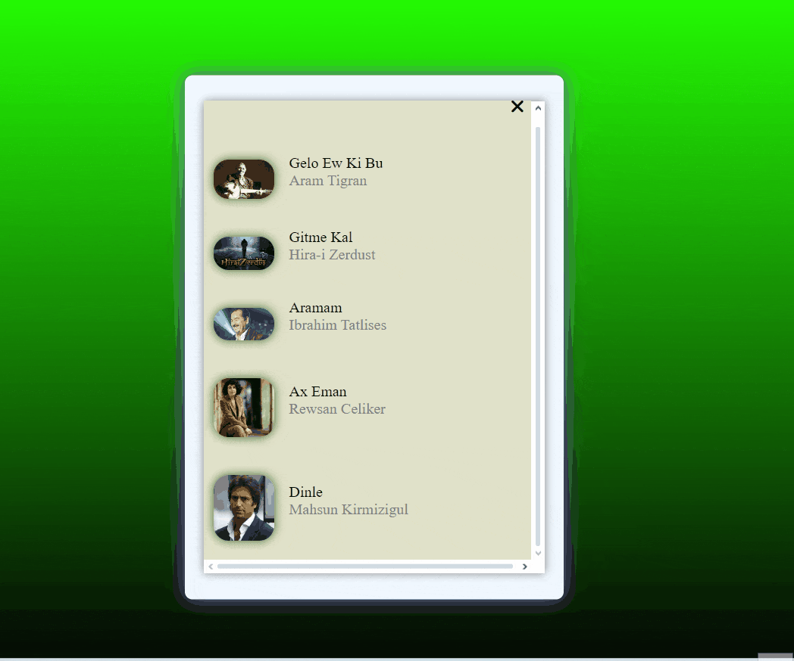

<h1>Mp3 Playlist Project</h1>

The purpose of the MP3 playlist project is to provide an interface and set of functionalities that allow users to organize, play, and manage their music files.
 
<h2>Technologies used in the project</h2>

Codded in HTML5, CSS3 and JS

<h2>Screen Gif</h2>

